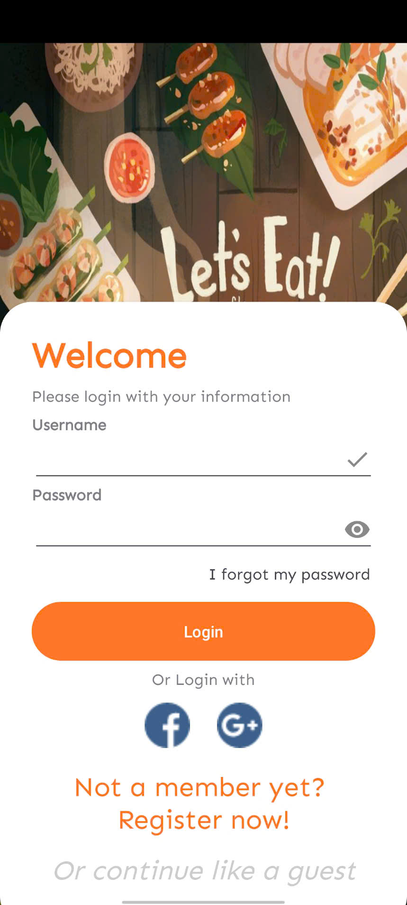
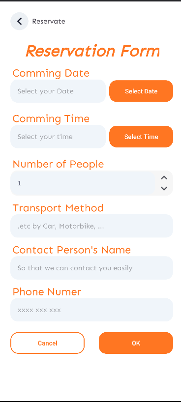
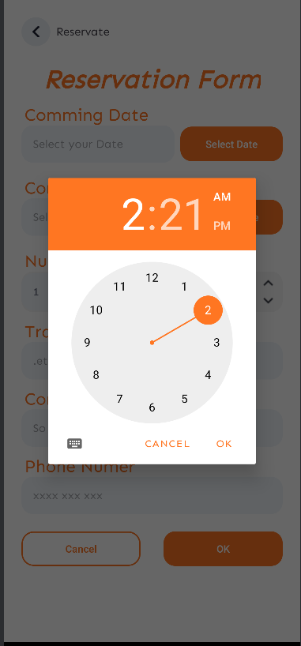
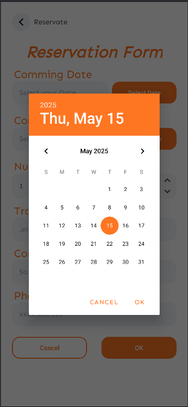

# Restaurant Food Ordering App – UI Overview

This document describes the main user interfaces (screens) of the mobile application **"Restaurant Food Ordering"**, developed as part of the Mobile Programming course at HCMUTE.

## 📱 Screens Overview

### 1. 🔐 Registration, OTP Verification & Login

- **Register Screen**  
  User signs up with basic credentials.

  

- **OTP Verification**  
  User receives an OTP and confirms account.

  

- **Login Screen**  
  Allows login or continuing as a guest.

  

---

### 2. 🏠 Home Screen

- **For Guest Users**  
  Prompt to login with a button.

  

- **For Logged-in Users**  
  Displays a dashboard with navigation to key features.

  

---

### 3. 📅 Reservation Form

- **Reservation Form**  
  Choose date, time, number of guests. Submit or cancel the booking.

  
  
  

---

### 4. 🎟️ Voucher Screens

- **My Vouchers**  
  View and delete saved vouchers.

  

- **Available Vouchers**  
  Save vouchers for future use.

  

---

### 5. ⚙️ Settings

- **Settings Screen**  
  Navigate to personal info, cart, favorites, etc.

  

---

### 6. 👤 Profile & Edit Profile

- **Profile View**  
  View user info.

  

- **Edit Profile & Upload Avatar**  
  Modify profile and upload a new picture.

  
  

---

### 7. 📍 Address Management

- **Address List**  
  View, delete, or set default address.

  

- **Add/Edit Address**  
  Add new or edit existing addresses.

  

---

### 8. 🛒 Cart

- **Cart Screen**  
  View items, increase/decrease quantity, delete items.

  

---

### 9. ❤️ Favorite Products

- **Favorite Screen**  
  View and manage liked dishes.

  

---

### 10. 🔔 Notifications & Order Tracking

- **Notifications**  
  View updates about ongoing, completed, or canceled orders.

  

- **Track Order / Breakdown / Rating**  
  View details, track status, rate or reorder.

  
  
  
  
   
  
   
  
   
  

---

### 11. 🍽️ Categories, Product List & Filters

- **Categories & Filter Tools**  
  Explore food categories and apply filters.

  
  

- **Product Detail View**  
  See image, price, description, and add to cart.

  

---

### 12. 💳 Payment

- **Payment Methods**  
  Select ZaloPay or cash for checkout.

  

- **Success Screen**  
  Confirmation and order tracking access.

  

---

## 📌 Notes

- UI design implemented with **Figma**.  
- App developed in **Java (Android Studio)**.  
- Backend built with **Spring Boot** and uses **JWT for authentication**.  
- Online payments handled via **ZaloPay SDK**.
